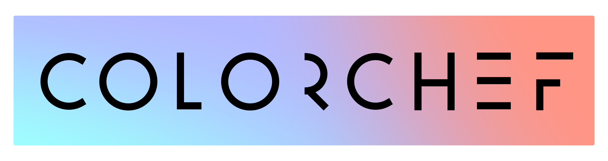

 

[Colorchef](https://colorchef.vercel.app) helps designers and developers with their projects for choosing right colors without hard work. It provides multiple utilities
which are helpful while designing your next web app.

This project is a color-based utility for designers to generate, select and save colors, shadows, palettes while maintaining [Web Content Accessibility Guidelines](https://www.w3.org/WAI/standards-guidelines/wcag/#intro).

## Getting started
---

Running project

```
npm run dev
```

Creating build

```
npm run build
```

## Features
---

- Color generator for fonts and background
- Shadow generator
- Dark palette generator for website
- Preset of styled buttons
- Golden ratio generator

## Technologies used 
---

    