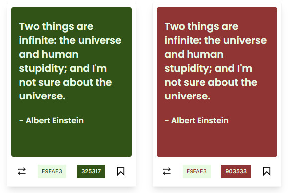

# 🎨 Colorchef

[Live Demo](https://colorchef.vercel.app/) • [Source Code](https://github.com/sidchigo/colorchef-next)


Colorchef is a modular, all-in-one color and UI utility tool designed for indie developers, designers, and solopreneurs. It simplifies decision-making around color, shadows, layout, and components, helping you move faster without sacrificing visual quality.


---

## ✨ Features

-   🎨 Generate and tweak color palettes with ease
-   🪞 Build custom box shadows visually
-   🌒 Convert palettes to dark themes instantly
-   🔘 Checkout styled buttons with instant previews
-   📐 Generate golden-ratio palettes from images
-   ⚡ Lightweight and responsive interface
-   📋 One-click copy for code snippets (CSS, HEX)

---

## 🧩 Modules

### 🎨 Colors

Generate beautiful and balanced color palettes using:

-   Random or contrast-based generation
-   Format: HEX
-   One-click copy for dev use

### 🪞 Shadows

Create aesthetic box shadows using:

-   Customizable offset, blur, spread, opacity
-   Real-time preview on card-style elements
-   Exportable CSS code snippet

### 🌒 Dark Palette

Generate accessible dark color palettes from light ones:

-   Auto contrast-adjusted variants
-   Maintain visual harmony across themes
-   Great for theme toggles or dark UI modes

### 🔘 Buttons

Design clean, customizable buttons:

-   Real-time preview of normal, hover and disabled states
-   Curated styles
-   Export plain CSS

### 📐 Golden Ratio

Use golden ratio to:

-   Generate beautiful palettes
-   Use random palettes
-   Use your images to generate custom palette from that

---

## 🛠️ Tech Stack

| Tech            | Purpose                                         |
| --------------- | ----------------------------------------------- |
| **Next.js**     | Framework with routing and performance benefits |
| **Firebase**    | For storing palettes and user auth              |
| **TailwindCSS** | Utility-first styling with responsiveness       |

---

## 📸 Screenshots

| Module       | Preview                                |
| ------------ | -------------------------------------- |
| Colors       |            |
| Shadows      |          |
| Dark Palette |  |
| Buttons      |          |
| Golden Ratio |  |

---

## 🚀 Getting Started

```bash
# Clone the repo
git clone https://github.com/sidchigo/colorchef-next.git

# Install dependencies
npm install

# Run the dev server
npm run dev
```

Visit http://localhost:3000 to view the app locally.

## 🧠 Learnings & Challenges

Built modular UI tools with reusable components

Designed with accessibility and responsiveness in mind

Focused on UX details like clipboard copy, animations, and visual clarity

Used custom logic and state management without heavy libraries

## 👥 Contributors

-   [Siddhesh Naik](https://github.com/sidchigo) – Creator & Lead Developer
-   [Chinmay Bhoir](https://github.com/chinmay-bhoir07) – Contributor (Design, UI/UX and Frontend Enhancements)

## 🤝 Contributing

Open to suggestions, ideas, and feature requests. Feel free to fork, submit issues, or create a PR.

## 📄 License

MIT License © [Siddhesh Naik](https://github.com/sidchigo)

## 🔗 Connect

💼 [LinkedIn](https://www.linkedin.com/in/siddheshnaik26/)

📧 [sid.naik26@gmail.com](mailto:sid.naik26@gmail.com)
